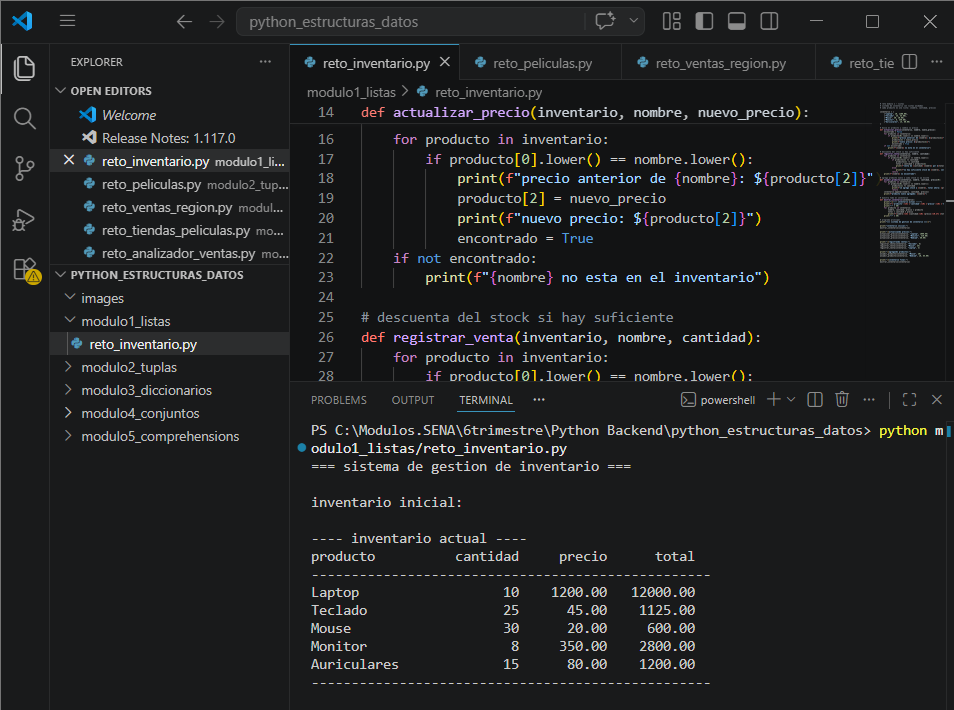
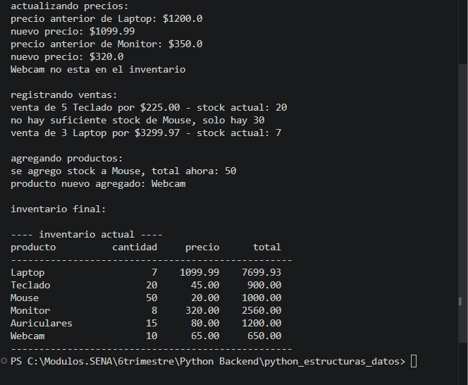
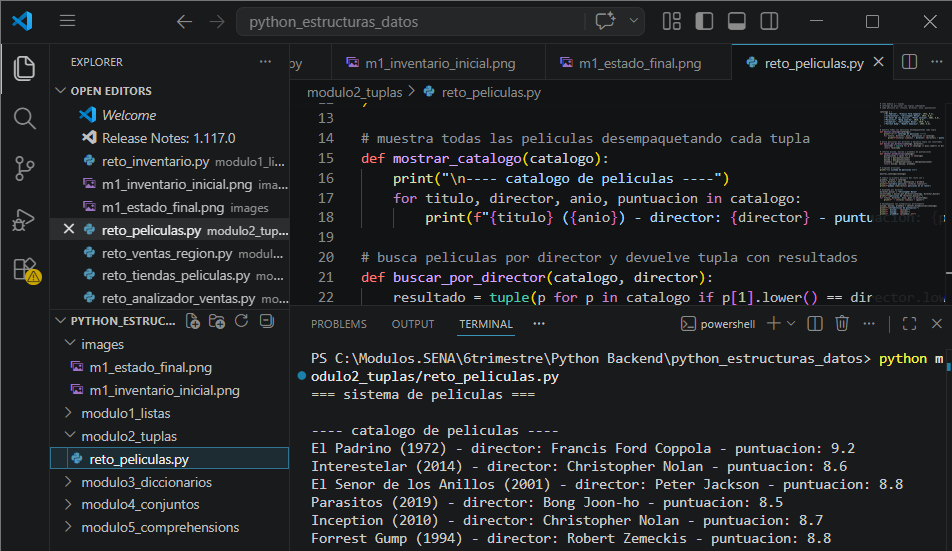
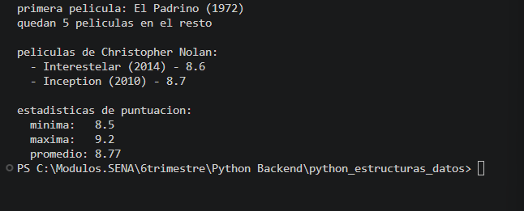
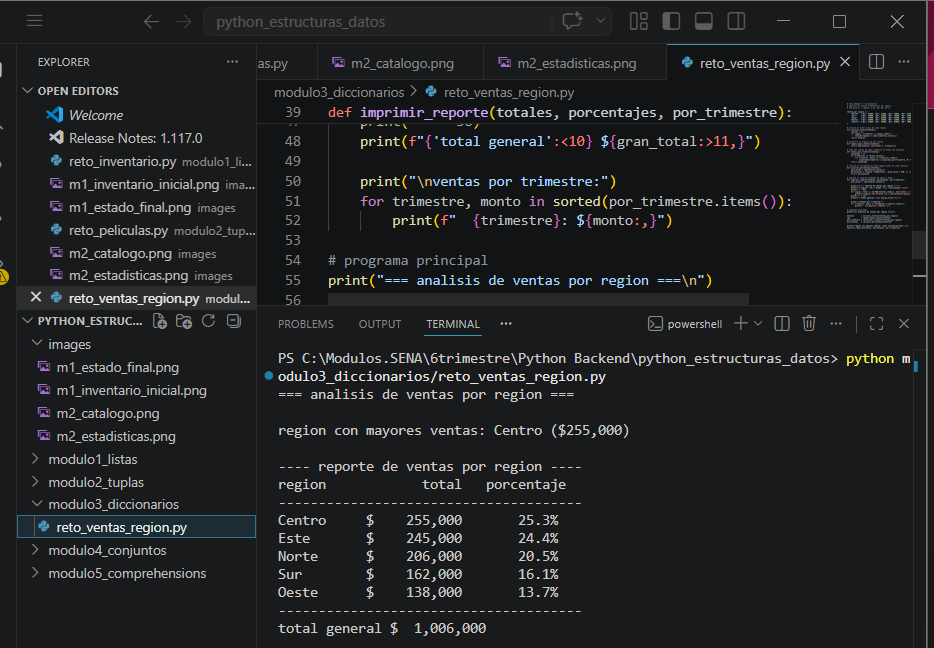
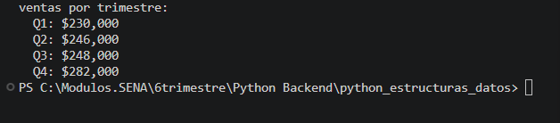
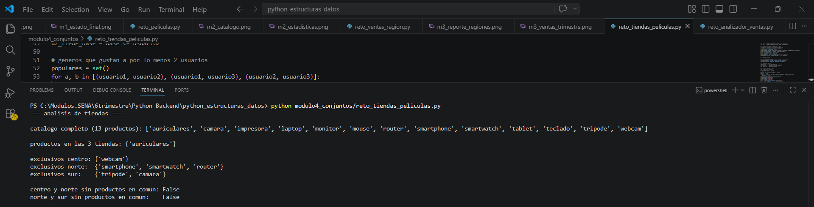
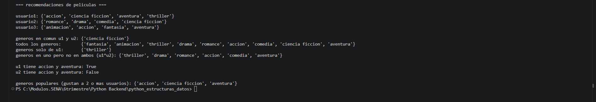
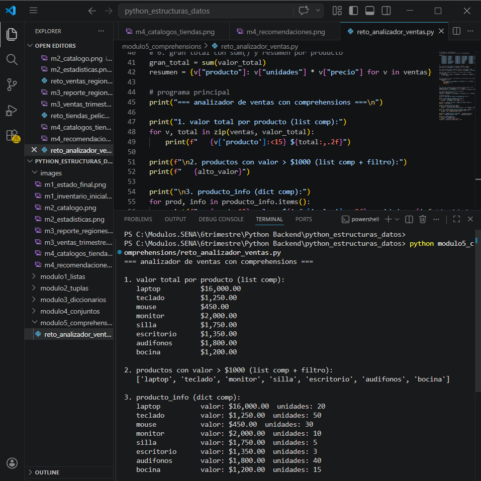
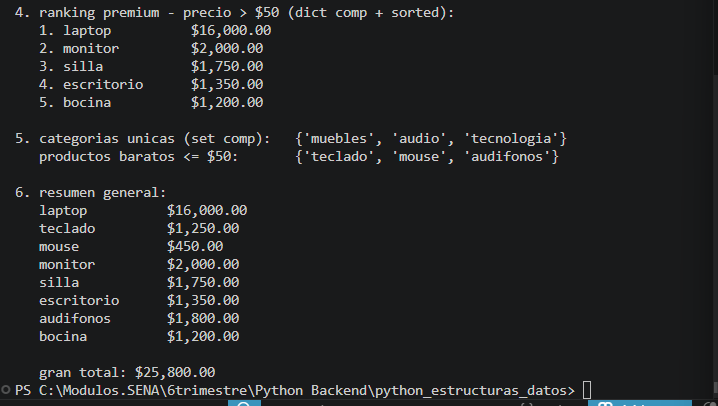

# Estructuras de Datos en Python
**GA1-220501093-04 · AA1 · EV03**

Desarrollado por: Sara Garcia  
Curso: Fundamentos de Python - SENA  

---

## Descripcion del proyecto

En este proyecto aplique los conocimientos adquiridos sobre estructuras de datos en Python. Cada modulo contiene la solucion al reto propuesto en el material formativo, usando listas, tuplas, diccionarios, conjuntos y comprehensions.

---

## Estructura del proyecto

```
python_estructuras_datos/
├── modulo1_listas/
│   └── reto_inventario.py
├── modulo2_tuplas/
│   └── reto_peliculas.py
├── modulo3_diccionarios/
│   └── reto_ventas_region.py
├── modulo4_conjuntos/
│   └── reto_tiendas_peliculas.py
├── modulo5_comprehensions/
│   └── reto_analizador_ventas.py
├── images/
└── README.md
```

---

## Temas aprendidos

### Modulo 1 - Listas
Las listas son colecciones ordenadas y mutables. Se pueden modificar despues de crearlas.
Aprendi a crear listas, acceder a sus elementos por indice, usar slicing, agregar y eliminar elementos, ordenarlos y recorrerlos con bucles. Tambien aprendi la diferencia entre copiar por referencia y usar copy() o deepcopy().

### Modulo 2 - Tuplas
Las tuplas son colecciones ordenadas pero inmutables, es decir que no se pueden modificar.
Son mas rapidas que las listas y se pueden usar como claves de diccionario porque son hashables. Aprendi a crearlas, acceder a sus elementos y a desempaquetar sus valores en variables usando el operador *.

### Modulo 3 - Diccionarios
Los diccionarios almacenan pares clave-valor. Las claves deben ser unicas e inmutables.
Aprendi a crear diccionarios, agregar, actualizar y eliminar pares, recorrerlos con items(), keys() y values(), y a crear diccionarios anidados. Tambien use dict comprehensions para transformar y filtrar datos.

### Modulo 4 - Conjuntos
Los conjuntos almacenan elementos unicos sin un orden especifico. La busqueda en ellos es muy rapida (O(1)).
Aprendi a crear sets, agregar y eliminar elementos, y a usar las operaciones de teoria de conjuntos: union, interseccion, diferencia y diferencia simetrica, tanto con metodos como con operadores matematicos (| & - ^).

### Modulo 5 - Comprehensions
Las comprehensions permiten crear listas, diccionarios y conjuntos en una sola linea de codigo de forma mas concisa y eficiente que un bucle tradicional.
Aprendi a usar list comprehension, dict comprehension y set comprehension, incluyendo filtros con if y como combinarlas para analizar datos reales.

---

## Evidencia de retos resueltos

### Reto 1 - Gestion de inventario (Listas)
Sistema que gestiona productos con listas anidadas. Permite actualizar precios, registrar ventas descontando stock y agregar productos nuevos.





---

### Reto 2 - Sistema de peliculas (Tuplas)
Catalogo de peliculas con tuplas inmutables. Implementa busqueda por director, separacion con operador * y calculo de estadisticas con retorno multiple.





---

### Reto 3 - Analisis de ventas por region (Diccionarios)
Analisis de ventas trimestrales con diccionarios anidados. Calcula totales, porcentajes y genera un reporte ordenado de mayor a menor.





---

### Reto 4 - Tiendas y peliculas (Conjuntos)
Analisis de catalogos de tres tiendas con operaciones de conjuntos. Tambien incluye recomendaciones de generos cinematograficos usando operadores matematicos.





---

### Reto 5 - Analizador de ventas (Comprehensions)
Uso de list, dict y set comprehension sobre un dataset de ventas para calcular totales, generar rankings y detectar categorias unicas.





---

## Reflexion final

Este proyecto me ayudo a entender cuando usar cada estructura de datos en Python. Las listas son utiles cuando necesito modificar los datos constantemente. Las tuplas son ideales cuando los datos no deben cambiar. Los diccionarios me facilitan organizar informacion relacionada como ventas por region. Los conjuntos son perfectos para eliminar duplicados y comparar grupos de datos. Las comprehensions me permitieron escribir codigo mas limpio y eficiente.

Lo mas importante que aprendi es que no hay una estructura mejor que otra, sino que cada una tiene su uso dependiendo del problema que se quiera resolver.

---

*Sara Garcia - SENA 2026*